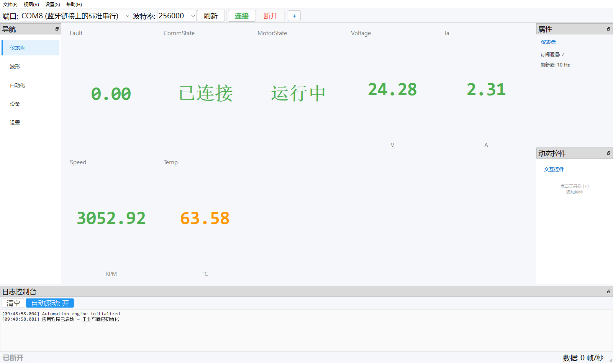
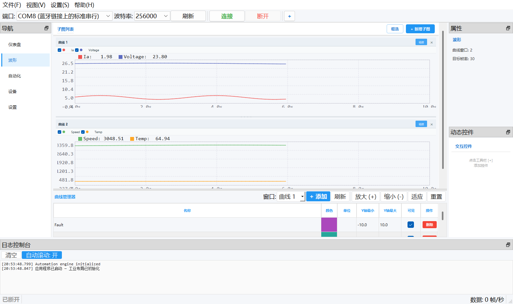
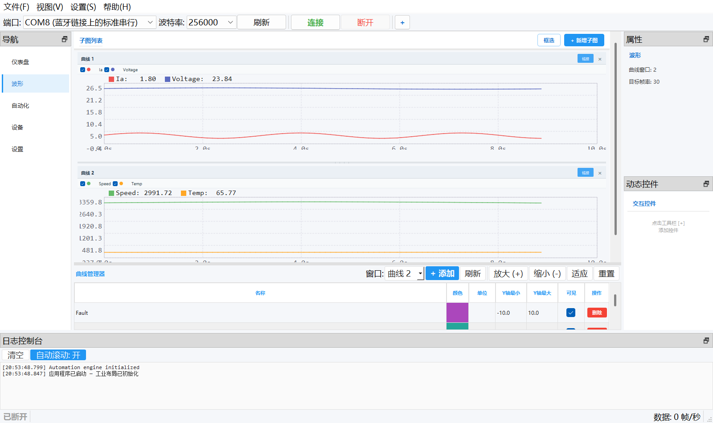
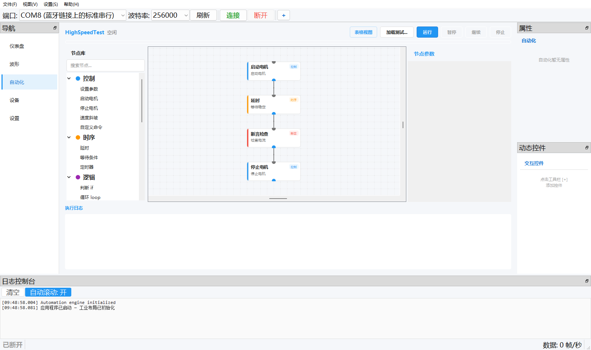
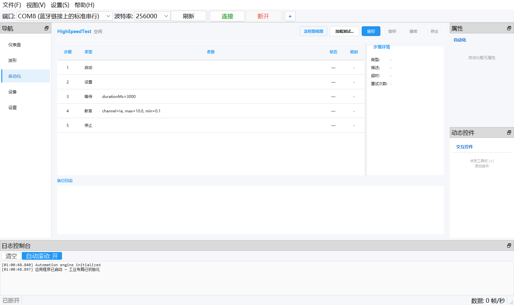
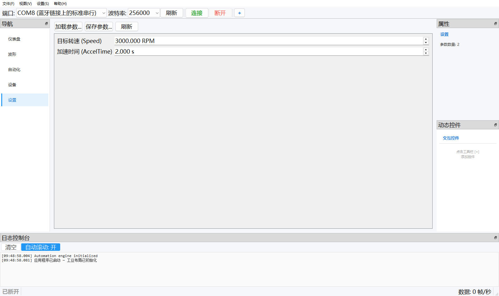
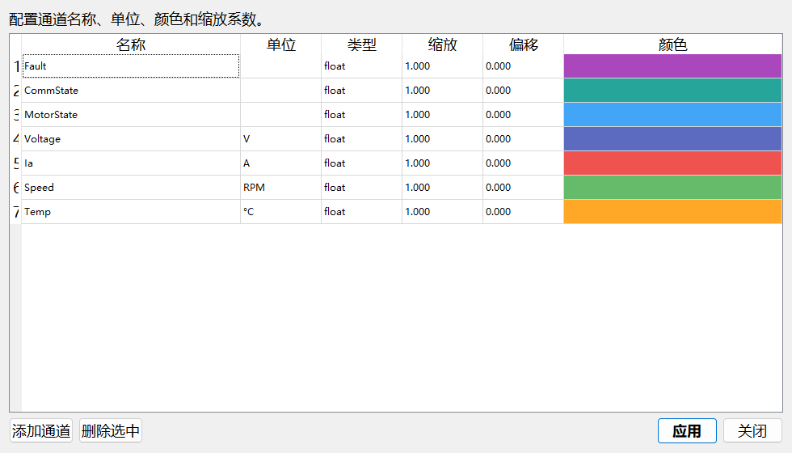
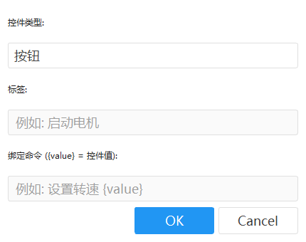

# 电机自动化平台（Motor Automation Studio）详细使用说明书

> 适用版本：电机自动化平台 v0.1（Qt 5.14.2 / C++17）
> 文档性质：面向最终用户的详细使用说明书

---

# 1 概述

## 1.1 软件简介

Motor Automation Studio（电机自动化平台）是一款工业级电机调试与自动化测试平台，面向电机驱动器的调试、监控与回归测试场景，提供以下核心能力：

- **串口通信**：通过串口（USB 串口、蓝牙串口等）与下位机（单片机/电机驱动器）连接，实时接收上行数据；
- **仪表盘监控**：以卡片形式实时显示故障、通信状态、电机状态、电压、电流、转速、温度等关键指标，并带告警配色；
- **实时波形显示**：单列多行滚动子图布局，支持多通道叠加、缩放、平移、框选、时间轴联动与曲线管理；
- **自动化测试**：以流程图方式编排测试节点（启动电机、延时、断言检查等），一键运行并自动生成测试报告；
- **参数管理**：查看、编辑、加载、保存电机参数（目标转速、加速时间等）；
- **故障检测**：集中显示活动故障并支持一键清除；
- **动态控件**：用户可自定义按钮/滑块/输入框，向下位机发送绑定命令。

## 1.2 运行环境

| 项目 | 要求 / 说明 |
|------|-------------|
| 操作系统 | Windows 10 / 11 |
| 运行库 | Qt 5.14.2，C++17 编译（见"帮助 → 关于"） |
| 通信接口 | 串口（COM 口），支持 USB 转串口、蓝牙串口 |
| 串口参数 | 8 数据位、无校验、1 停止位、无流控（8N1，固定） |
| 默认波特率 | 256000（可在工具栏下拉框修改） |
| 上行数据协议 | VOFA+ JustFloat / VOFA+ FireWater |
| 下行命令协议 | 文本 `key=value` 命令（以 `\n` 或 `\r` 结尾） |

## 1.3 主界面布局总览



主界面采用工业布局，自上而下、自左而右分为以下区域：

| 区域 | 位置 | 说明 |
|------|------|------|
| 菜单栏 | 顶部 | 文件(F)、视图(V)、设置(S)、帮助(H) 四个菜单 |
| 串口工具栏 | 菜单栏下方 | 端口下拉框、波特率下拉框、刷新、连接、断开、"+"（添加动态控件） |
| 导航栏 | 左侧 | 切换五个功能页面：仪表盘、波形、自动化、设备、设置 |
| 工作区 | 中部 | 显示当前导航页面的内容（卡片、曲线、流程图、参数表等） |
| 属性面板 | 右上 | 显示当前页面的属性信息，如仪表盘页显示"订阅通道: 7、刷新率: 10 Hz"，波形页显示"曲线窗口: 2、目标帧率: 30" |
| 动态控件面板 | 右下 | 显示用户创建的交互控件；未创建时提示"点击工具栏 [+] 添加控件" |
| 日志控制台 | 底部 | 显示运行日志，提供"清空"按钮与"自动滚动: 开/关"开关 |
| 状态栏 | 最底部 | 左侧显示连接状态（已断开/已连接），右侧显示实时数据速率（"数据: n 帧/秒"） |

操作提示：点击导航栏条目即可切换页面；各面板标题栏右侧的小图标用于面板浮动/收起等窗口操作。

---

# 2 设备连接

本章说明如何通过串口将上位机与下位机（单片机/驱动器）建立连接。

## 2.1 连接步骤

1. 用串口线（USB 转串口、蓝牙串口等）连接电脑与设备，并给设备上电。下位机上电后即可按周期上传数据，**无需等待握手**。
2. 在顶部工具栏的 **端口** 下拉框中选择目标串口（如 "COM8 (蓝牙链接上的标准串行)"）。端口列表**每 2 秒自动刷新**一次，新插入的设备稍等片刻即会出现；也可点击 **刷新** 按钮立即刷新。
3. 在 **波特率** 下拉框中选择与下位机一致的波特率，默认为 **256000**。
4. 点击 **连接** 按钮。连接成功后：
   - 状态栏左侧由"已断开"变为"已连接"；
   - 状态栏右侧开始显示实时帧率（"数据: n 帧/秒"）；
   - 仪表盘 CommState 卡片显示"已连接"。
5. 需要中断通信时，点击 **断开** 按钮即可。

## 2.2 端口与波特率

| 项目 | 说明 |
|------|------|
| 串口格式 | 固定 8N1（8 数据位、无校验、1 停止位），无硬件流控 |
| 默认波特率 | 256000 |
| 端口列表刷新 | 每 2 秒自动刷新一次，也可点击"刷新"手动刷新 |
| 波特率一致性 | **下位机波特率必须与上位机一致**，否则收不到任何数据（最常见的联调失败原因） |

## 2.3 状态栏与通信状态

- 状态栏**左侧**显示连接状态：`已断开` / `已连接`。
- 状态栏**右侧**显示 `数据: n 帧/秒`，表示当前每秒解析出的数据帧数；连接正常且下位机在发数时该值大于 0。
- 仪表盘 **CommState** 卡片以数值语义显示通信状态（0 = 已断开，1 = 已连接，2 = 超时），详见第 4 章。
- 日志控制台会输出连接、断开、初始化等事件日志，可点击"清空"清除，或用"自动滚动"开关控制是否跟随最新日志。

## 2.4 断开连接

点击工具栏 **断开** 按钮即断开串口。断开后波形停止刷新、仪表盘数值停止更新，状态栏回到"已断开"。断开状态下仍可编辑工程、编排自动化流程、配置通道等离线操作。

---

# 3 通信协议

本章说明上位机与下位机之间的数据格式。其中 3.1～3.3 为**当前版本实际启用**的协议，3.4～3.5 为预留/设计阶段的协议参考，3.6 为单片机对接检查清单。

## 3.1 VOFA+ JustFloat（上行实时数据，当前实际使用）

JustFloat 为原始 float 字节流：**每个通道 4 字节，IEEE 754 单精度，小端序**（与 ARM Cortex-M 原生字节序一致，单片机侧可直接按地址拷贝发送）。例如 `1.5f` 的字节为 `00 00 C0 3F`。

**上位机切帧方式（关键）**：上位机按**固定通道数**切帧，`帧长 = 通道数 × 4` 字节，**不识别 VOFA+ 标准帧尾 `00 00 80 7F`**。当前上位机通道数默认为 **8**，即每 32 字节切为一帧。

```
方案 A 帧布局（直连本上位机，推荐）：每帧固定 8 个 float，不加帧尾
字节偏移  0      4      8      12     16     20     24     28     32
        ┌──────┬──────┬──────┬──────┬──────┬──────┬──────┬──────┐
        │ CH0  │ CH1  │ CH2  │ CH3  │ CH4  │ CH5  │ CH6  │ CH7  │
        │float │float │float │float │float │float │float │float │
        │ 4B LE│ 4B LE│ 4B LE│ 4B LE│ 4B LE│ 4B LE│ 4B LE│ 4B LE│
        └──────┴──────┴──────┴──────┴──────┴──────┴──────┴──────┘
        └────────────────── 32 字节/帧，无帧尾 ──────────────────┘
```

**帧尾与通道数必须匹配，二选一**：

| 方案 | 下位机发送 | 上位机通道数设置 | 适用场景 |
|------|-----------|------------------|----------|
| 方案 A（推荐直连上位机） | 每帧固定 8 个 float（32 字节），**不加帧尾** | 默认 8，直接对齐 | 直连本上位机 |
| 方案 B（标准 VOFA+） | N 个数据 float + 帧尾 `00 00 80 7F` | 设为 **N+1**（帧尾被解析成一个 `+inf` 通道） | 需要兼容 VOFA+ 桌面软件时 |

```
方案 B 帧布局：N 个数据 + 4 字节帧尾（上位机通道数须设 N+1）
        ┌────────┬────────┬─────┬────────┬─────────────────┐
        │ 数据 0 │ 数据 1 │ ... │ 数据 N-1 │ 帧尾            │
        │ float  │ float  │     │ float  │ 00 00 80 7F     │
        └────────┴────────┴─────┴────────┴─────────────────┘
```

> **警告（帧尾坑）**：若两者不匹配（例如发了 8 个 float 又加帧尾，而上位机仍按 8 通道切帧），帧长变成 36 字节，**从第二帧起数据永久错位**，波形全部错乱。单片机固件中可用宏（如 `VOFA_ENABLE_FRAME_TAIL`）控制是否加帧尾：直连上位机置 0，连 VOFA+ 桌面软件置 1。

其他要点：

- 发送节奏：用控制环/定时器**周期性**整帧发送，每帧字节数固定，便于上位机按通道数对齐；
- 带宽参考：256000 波特 ≈ 25.6 KB/s，每帧 32 字节时理论上限约 800 帧/s，实际建议 ≤ 200 帧/s（留 3～5 倍余量）。

## 3.2 VOFA+ FireWater

FireWater 为文本格式：**ASCII 浮点数，通道之间用分隔符（逗号）分隔，默认以 `\n` 结尾**，一行即一帧。示例：

```
1.87,23.82,3049.88,64.90
2.31,24.28,3052.92,63.58
```

FireWater 便于人工阅读与调试，但传输效率低于 JustFloat，适合低帧率场景。

## 3.3 下行文本命令（上位机 → 下位机）

下行命令为文本格式：`key=value`，以 `\n` 或 `\r` 结尾。示例：

```
speed=1200\r\n
start=1\n
```

- 数值按十进制解析，整数字段由下位机自行取整；
- **一条命令即一行**，不要在同一行拼多条；解析器按行缓冲处理，天然抗半包/粘包；
- 建议下位机实现的命令键（与参考实现一致）：`speed=` / `up_time=` / `down_time=` / `start=` / `stop=` / `set_iq=` / `set_id=` / `calib=`。

> **注意**：当前版本上位机**没有自动发送命令的代码**（接收线程只收不发）。联调下行命令时，可通过第 10 章的**动态控件**或外部**串口终端**手工下发命令，先验证单片机解析正确。

## 3.4 预留二进制帧协议（当前未启用，仅供参考）

上位机已实现该协议的编解码，但**未接入当前接收路径**（当前接收路径使用 JustFloat）。如需启用，以本节为准。

### 3.4.1 帧结构

```
┌────────────┬──────────────────┬───────────────┬────────────────┬───────────────┬──────────┐
│  AA  │  55  │ DevID   │  Cmd    │  Len (2B LE)  │ Payload (LenB) │ CRC16 (2B LE) │ 0D  0A   │
│      │      │ (1B)    │ (1B)    │               │                │               │          │
└────────────┴──────────────────┴───────────────┴────────────────┴───────────────┴──────────┘
└─ 同步头 ┘ └──────── header 共 6 字节 ────────┘                  └── 校验（低字节在前）──┘ └─ 帧尾 ─┘
```

- CRC16 计算范围：从 `AA` 起，共 **6 + Len** 字节（header + payload）；
- CRC16 算法：**CRC-16/XMODEM** —— 多项式 `0x1021`，初值 `0x0000`，输入/输出不反转、结果无异或；追加时**低字节在前**；
- 容错行为：无同步头的字节被丢弃，乱码时向前扫描 `AA 55` 重新同步；CRC 错误的帧仍会产出但标记 `crcValid=false`；帧尾 `0D 0A` 校验失败会计入帧错误。

**CRC 测试向量**（用于验证下位机 CRC 实现是否正确）：

| 帧内容（不含 CRC/帧尾） | CRC16 结果 | 追加字节（低字节在前） |
|--------------------------|-----------|------------------------|
| `AA 55 01 03 00 00`（DevID=01, CmdWrite, 空载荷） | `0x7EAB` | `AB 7E` |
| `AA 55 01 07 00 00`（Reset） | `0xA26B` | `6B A2` |
| `AA 55 01 01 32 00`（DataUpload, Len=50） | `0x733C` | `3C 73` |

### 3.4.2 命令码（MotorCommand）

| 码 | 命令 | 方向 | 含义 |
|----|------|------|------|
| 0x01 | DataUpload | 设备→主机 | 实时数据上传 |
| 0x02 | CmdRead | 主机→设备 | 读参数 |
| 0x03 | CmdWrite | 主机→设备 | 写参数 |
| 0x04 | Ack | 设备→主机 | 应答 |
| 0x05 | Nack | 设备→主机 | 否定应答 |
| 0x06 | Heartbeat | 设备→主机 | 心跳 |
| 0x07 | Reset | 主机→设备 | 复位 |

### 3.4.3 DataUpload 载荷（字段顺序固定）

| 字段 | 类型 | 字节 |
|------|------|------|
| timestamp | uint32 LE | 4 |
| ia, ib, ic, id, iq | float LE × 5 | 20 |
| speed, position | float LE × 2 | 8 |
| busVoltage, busCurrent, temperature | float LE × 3 | 12 |
| fault | uint16 LE | 2 |

合计 **46 字节**（1×uint32 + 10×float + 1×uint16）。

> **注意**：上位机注释曾声称该载荷为 50 字节，但按 packed 计算实际为 46 字节。正式启用该协议前需两端统一定义。

## 3.5 完整命令码与流数据帧参考（设计文档）

以下为设计文档中规划的完整命令码空间（16 位命令码），作为协议参考列出：

| 地址段 | 用途 | 代表命令码 |
|--------|------|-----------|
| 0x0000–0x0FFF | 系统命令 | 0x0000 空操作/心跳、0x0001 查询协议版本、0x0003 软复位、0x0004 查询设备信息、0x00FF 大包分片 |
| 0x1000–0x1FFF | 参数读写 | 0x1001 读参数、0x1002 写参数、0x1003 批量读、0x1004 批量写、0x1005 保存到 Flash、0x1006 恢复出厂 |
| 0x2000–0x2FFF | 电机控制 | 0x2001 使能电机、0x2002 禁用电机、0x2003 紧急停止、0x2004 设置目标转速、0x2005 设置目标位置、0x2006 设置目标转矩、0x200B 清除故障 |
| 0x3000–0x3FFF | 诊断与状态 | 0x3001 读状态、0x3002 读故障日志、0x3003 读温度、0x3004 读电流、0x3005 读电压、0x3006 读编码器、0x3007/0x3008 启停示波器模式 |
| 0x4000–0x4FFF | 固件升级 | 0x4001 擦除、0x4002 写数据块、0x4003 校验、0x4004 提交 |
| 0x8000–0x8FFF | 实时变量流 | 0x8001 实时变量流 |
| 0x9000–0x9FFF | 波形数据流 | 0x9001 电流波形、0x9002 速度波形、0x9003 位置波形 |

**流数据帧（实时变量流）载荷格式**：

```
┌─────────────┬───────────────┬──────────────────────────────────────────┐
│  timestamp  │  var_count    │  variable[0] │ variable[1] │ ... [N-1]   │
│ uint64 (8B) │ uint16 (2B)   │  每项: var_id(2B) + value(4B, 固定)      │
└─────────────┴───────────────┴──────────────────────────────────────────┘
总载荷长度 = 8 + 2 + var_count × (2 + 4) = 10 + var_count × 6
```

示例（两路变量：温度 35.5°C、电流 12.3A）：

```
[00 00 00 00 3B 2A FC 18]  ← timestamp (uint64, 小端)
[02 00]                    ← var_count = 2
[01 80] [00 00 0E 42]      ← var_id=0x8001, value=35.5f
[02 80] [CD CC 44 41]      ← var_id=0x8002, value=12.3f
```

设计文档中预定义的变量 ID 参考：0x8001 电机温度(°C)、0x8002 A 相电流(A)、0x8003 B 相电流、0x8004 C 相电流、0x8005 母线电压(V)、0x8006 转速(rpm)、0x8007 位置(deg)、0x8008 转矩(Nm) 等。所有多字节字段一律小端序。

## 3.6 单片机对接检查清单

- [ ] 单片机与上位机**波特率一致**（默认 256000），8N1、无流控；
- [ ] JustFloat **通道数一致**；帧尾开关与上位机通道数匹配（3.1 节方案 A/B 二选一）；
- [ ] 先单独用 **VOFA+ 桌面软件**验证单片机波形正确（标准帧尾），再连本上位机；
- [ ] 用串口终端下发 `speed=1000\n` 等命令，确认单片机解析回调触发；
- [ ] 若启用二进制帧协议，用 3.4.1 节测试向量验证 CRC 实现；
- [ ] 使用 DMA 发送时，在发送回调内先拷贝到独立缓冲再触发 DMA，防止下一帧覆盖未发完的缓冲。

---

# 4 仪表盘

仪表盘以卡片形式实时显示电机运行的关键指标，是日常监控的第一入口（界面见图 1-1）。

## 4.1 卡片说明

| 卡片 | 显示内容 | 单位 |
|------|----------|------|
| Fault | 当前活动故障数量（0.00 表示无故障） | — |
| CommState | 通信状态：已断开 / 已连接 / 超时 | — |
| MotorState | 电机状态：已停止 / 运行中 / 故障 | — |
| Voltage | 实时电压 | V |
| Ia | 实时 A 相电流 | A |
| Speed | 电机转速 | RPM |
| Temp | 电机温度 | °C |

图 1-1 中：Voltage=24.28 V、Ia=2.31 A、Speed=3052.92 RPM 均为绿色（正常），Temp=63.58 °C 为橙色（警告），直观体现了告警配色。

## 4.2 告警级别

数值卡片按告警级别着色：**绿色（正常）→ 黄色（警告）→ 红色（严重）**。当某通道数值越过警告/严重阈值时，卡片数值自动变色，便于巡检时一眼发现异常。

## 4.3 状态卡数值语义

两张状态卡片以 0/1/2 三态显示：

| 数值 | 电机状态（MotorState） | 通信状态（CommState） |
|------|------------------------|----------------------|
| 0 | 已停止 | 已断开 |
| 1 | 运行中 | 已连接 |
| 2 | 故障 | 超时 |

## 4.4 属性面板

仪表盘页右侧属性面板显示当前页属性，例如：

- **订阅通道: 7** —— 仪表盘当前订阅的通道数量；
- **刷新率: 10 Hz** —— 卡片数值刷新频率。

---

# 5 波形显示

波形页以"单列多行滚动子图"布局实时显示电机数据曲线，每个子图可独立配置通道，是分析电机动态行为的核心页面。



## 5.1 页面布局

- **子图列表**（中部）：自上而下排列各子图。每个子图包含：标题栏（子图名 + "链接/独立"按钮 + "×"删除按钮）、通道栏（每通道一个复选框与颜色点）、实时值图例（如 `Ia: 1.87  Voltage: 23.82`）、曲线绘图区（带网格与时间轴刻度）。
- **工具按钮**（子图列表右上角）：`框选`（开关框选放大模式）、`+ 新增子图`。
- **曲线管理器**（子图列表下方）：集中管理各窗口的通道，详见 5.5。
- **属性面板**（右侧）：显示"曲线窗口: n""目标帧率: 30"等。

## 5.2 子图管理

| 操作 | 方式 |
|------|------|
| 新增子图 | 点击右上角 "+ 新增子图" 按钮 |
| 删除子图 | 点击子图标题栏右侧 "×" 按钮 |
| 重命名子图 | 双击子图标题栏名称 |
| 调整子图高度 | 拖拽子图底部的分隔线 |
| 配置通道 | 在子图通道栏勾选/取消通道复选框，或右键通道栏在弹出菜单中选择通道，或在曲线管理器中"+ 添加" |
| 时间轴联动切换 | 点击标题栏右侧 "链接/独立" 按钮 |

## 5.3 曲线操作

| 操作 | 方式 |
|------|------|
| 时间轴缩放 | 鼠标滚轮 —— **鼠标停在哪个子图上就缩放哪个子图**的时间轴 |
| 值轴缩放 | Ctrl + 鼠标滚轮 |
| 滚动整个区域 | 鼠标左键拖拽（默认状态，不开启框选时） |
| 框选放大 | 先点击工具栏"框选"按钮开启，再左键拖拽矩形区域 |
| 平移 | 鼠标右键拖拽 |
| 自适应 | 双击曲线区域 |

> 说明：滚轮**只缩放曲线、不滚动整个区域**；区域滚动用左键拖拽完成。这一设计避免了"想缩放却把页面滚走"的误操作。

## 5.4 时间轴联动

- 默认所有子图**共用时间轴**：在任一子图上缩放/平移，其他链接状态的子图同步联动，便于对齐多个物理量的时间关系；
- 每个子图可通过标题栏 **"链接/独立"** 按钮切换为独立时间轴，单独观察某一子图的时间范围；
- 曲线管理器中的"适应""重置"按钮可对选中窗口做自适应与复位。

## 5.5 曲线管理器

曲线管理器位于曲线窗口下方。它的通道表**以全局通道注册表为视角**：表中列出当前所有已注册通道（无论是否已加入某个子图），对名称、单位、颜色的编辑会写入注册表并**全局生效**；而 Y 轴范围与可见性则作用于上方"窗口"下拉框选中的子图。

| 控件/列 | 功能 |
|---------|------|
| 窗口下拉框 | 选择要施加 Y 轴范围/可见性操作的子图窗口（如"曲线 1""曲线 2"） |
| + 添加 | 打开通道配置对话框，新增一个全局通道（同时注册进曲线引擎） |
| 刷新 | 从注册表重新载入通道列表 |
| 放大 (+) / 缩小 (-) | 对选中窗口缩放 |
| 适应 | 自适应显示选中窗口数据 |
| 重置 | 恢复默认视图 |
| 名称（列） | 通道名称，双击可编辑（写入注册表，全局生效） |
| 颜色（列） | 通道曲线颜色，双击可修改（**全局生效**，所有子图同步变色） |
| 单位（列） | 通道单位，双击可编辑 |
| Y轴最小 / Y轴最大（列） | 该通道在**选中窗口**的值轴显示范围 |
| 可见（列） | 勾选/取消以控制该通道在**选中窗口**的显示/隐藏 |
| 操作（列） | "删除"按钮：经确认后从**所有子图、曲线引擎与注册表**中删除该通道 |

> 提示：若只想让某通道不在某个子图显示，用"可见"列取消勾选即可；"删除"是全局移除，会影响所有已使用该通道的子图。

## 5.6 多子图布局

点击"+ 新增子图"后，页面变为三个（或更多）子图纵向排列的布局，新子图默认带空通道栏（点击通道栏中的 "+" 或到曲线管理器添加通道），各子图可独立配置高度与通道组合。下图同时展示了曲线管理器"窗口"下拉框选中"曲线 2"时的通道管理状态：表格列出全部已注册通道，可逐通道设置颜色、Y 轴范围与可见性。



---

# 6 自动化测试

自动化页用于以流程图方式编排并执行电机自动化测试：从节点库拖出节点、连线组成测试流程，一键运行后自动逐步执行、断言检查并输出结果与报告。支持**流程图视图**（默认）与**表格视图**两种视图，通过工具栏按钮切换。

## 6.1 流程图视图与画布操作



**布局**：

- 左侧 **节点库**：按分类列出全部节点类型，顶部有搜索框，双击节点或拖入画布即可添加；
- 中央 **画布**：拖拽节点、创建连线、框选；节点卡片显示名称、描述与分类标签（如"控制""时序""断言"），上下圆点为输入/输出端口；
- 右侧 **节点参数面板**：选中节点后在此编辑该节点参数；
- 下方 **执行日志**：运行时输出每步执行明细；
- 顶部 **工具栏**：表格视图（视图切换）、加载测试...、运行、暂停、继续、停止；标题处显示用例名与状态（空闲 / PASSED 等）。

**画布操作表**：

| 操作 | 方式 |
|------|------|
| 添加节点 | 双击节点库中的节点，或将其拖入画布 |
| 移动节点 | 鼠标拖拽节点卡片 |
| 创建连线 | 从节点输出端口拖到另一节点（松开在节点主体或输入端口即可） |
| 删除节点/连线 | 选中后按 Delete 键 |
| 编辑参数 | 选中节点后在右侧节点参数面板编辑 |
| 画布缩放 | Ctrl + 滚轮 |
| 右键菜单 | 编辑参数 / 删除节点 |

## 6.2 节点类型

节点库共 9 大分类、22 种节点：

| 分类 | 节点 |
|------|------|
| 控制 | 设置参数、启动电机、停止电机、速度斜坡、自定义命令 |
| 时序 | 延时、等待条件、定时器 |
| 逻辑 | 判断 if、循环 loop、分支 switch、跳转 |
| 数学 | 计算、变量赋值 |
| 通信 | 读参数、写寄存器 |
| 数据 | 记录数据、日志输出、导出 |
| 断言 | 断言 |
| 异常 | 异常处理 |
| 流程 | 子流程、注释 |

**节点执行支持情况**：

| 状态 | 节点 |
|------|------|
| 已实现执行 | 设置参数、启动电机、停止电机、延时、判断 if、循环 loop、计算、变量赋值、读参数、记录数据、日志输出、断言、子流程、注释 |
| 尚未实现执行 | 速度斜坡、自定义命令、定时器、分支 switch、跳转、写寄存器、发送命令、导出、异常处理 |

> 运行到未实现节点时，执行日志会明确报"未实现的节点类型"，不会静默跳过（排查方法见附录 A）。

## 6.3 表达式系统

判断 if、断言、计算等节点的条件/公式使用统一表达式语法：

| 类别 | 支持内容 | 示例 |
|------|----------|------|
| 四则运算 | `+  -  *  /` | `(channel:Ia + channel:Ib) / 2` |
| 比较运算 | `<  >  <=  >=  ==  !=` | `channel:Speed > 1400` |
| 逻辑运算 | `&&  ||  !` | `$温度 < 85 && $转速 > 1400` |
| 函数 | `min` `max` `abs` `avg` | `max(channel:Ia, channel:Ib) < 10` |
| 变量引用 | `$变量名` | `$目标转速` |
| 通道引用 | `channel:通道名` | `channel:Ia` |

完整示例：

```
(channel:Ia + channel:Ib + channel:Ic) / 3 > 10
$温度 < 85 && $转速 > 1400
```

## 6.4 运行控制与执行结果

1. 点击 **加载测试...**，选择 JSON 测试用例文件（流程图格式或旧版表格格式均可，旧格式会自动转换为流程图）；
2. 点击 **运行** 开始执行，当前正在执行的节点在画布上**高亮为金色**；
3. 运行中可使用 **暂停 / 继续 / 停止** 控制（均可正常响应）；
4. 执行完成后，标题栏显示结果状态（如绿色 **PASSED**），下方执行日志给出逐步明细，并显示汇总条。

![图 6-2 测试执行完成（表格视图下）：标题栏 HighSpeedTest 显示绿色 PASSED；执行日志含 Step 4/5 检查电流、"Assert PASS: Ia = 2.455865 in [0.1, 10.0]"、Step 5/5 停止电机、"=== 测试PASSED === (耗时: 3028 ms)"；底部汇总条"总计:5 | 通过:5 | 失败:0 | 跳过:0 | 耗时:3028 ms"](screenshots/03c_automation_result.png)

执行日志示例（节选）：

```
[09:49:52.275] Step 4/5: 检查电流
[09:49:52.277]   Assert PASS: Ia = 2.455865 in [0.1, 10.0]
[09:49:52.280] Step 5/5: 停止电机
[09:49:52.281]   StopMotor: OK
[09:49:52.281] Test PASSED
[09:49:52.282] === 测试PASSED === (耗时: 3028 ms)
```

汇总条格式：`总计:n | 通过:n | 失败:n | 跳过:n | 耗时:n ms`。

## 6.5 表格视图

表格视图保留原有"步骤表"式编辑与执行方式，适合简单的顺序测试。点击工具栏"表格视图/流程图视图"按钮可在两种视图间切换。



**步骤状态标识**：

| 标识 | 颜色 | 含义 |
|------|------|------|
| ● | 蓝色 | 正在执行 |
| √ | 绿色 | 通过 |
| × | 红色 | 失败 |
| — | 灰色 | 跳过 |

选中某一步骤时，右侧"步骤详情"面板显示该步骤的类型、描述、超时、重试次数。

## 6.6 JSON 用例格式与示例

旧版表格型 JSON 用例支持的步骤类型：

| 类型 | 说明 |
|------|------|
| StartMotor | 启动电机 |
| StopMotor | 停止电机 |
| SetParameter | 设置参数 |
| ReadParameter | 读取参数 |
| Wait | 等待指定毫秒 |
| Assert | 断言检查（min/max/equals） |
| RecordData | 记录数据 |
| Custom | 自定义步骤 |

完整可复制示例（HighSpeedTest，5 步）：

```json
{
    "name": "HighSpeedTest",
    "description": "高速电机测试",
    "steps": [
        {
            "type": "StartMotor",
            "description": "启动电机",
            "timeoutMs": 5000
        },
        {
            "type": "SetParameter",
            "description": "设置转速",
            "params": [{"Speed": "3000"}],
            "timeoutMs": 1000
        },
        {
            "type": "Wait",
            "description": "等待稳定",
            "params": {"durationMs": "3000"},
            "timeoutMs": 3000
        },
        {
            "type": "Assert",
            "description": "检查电流",
            "params": {"channel": "Ia", "min": "0.1", "max": "10.0"},
            "timeoutMs": 1000
        },
        {
            "type": "StopMotor",
            "description": "停止电机",
            "timeoutMs": 5000
        }
    ]
}
```

> **旧格式转换注意事项（重要）**：旧表格 JSON 加载时会自动转换为流程图。转换时：
>
> - `Wait` 步骤必须带平铺键参数 `params {"durationMs": "..."}`；
> - `Assert` 步骤必须带平铺键参数 `params {"channel": "通道名", "min": "..", "max": ".."}`；
> - 若缺少上述平铺键，运行时会分别报 `invalid duration` / `no channel specified` 错误（见附录 A）。
>
> 另外，`SetParameter` 的多个参数会被自动拆分为多个"设置参数"节点；`Assert` 的 channel/min/max 会自动转换为条件表达式。

## 6.7 测试报告

每次测试执行完成后，软件自动生成 **HTML 与 CSV 两种格式**的测试报告，保存在程序运行目录下的 `./reports/` 目录中。报告包含测试名称、开始/结束时间、总耗时、逐步结果（通过/失败/跳过）、断言明细（如 `Ia = 2.455865 in [0.1, 10.0]`）与汇总统计，可用于归档与回归对比。

---

# 7 设备与故障

设备页集中显示设备当前的活动故障列表，是故障排查的入口。

![图 7-1 设备页：顶部左侧显示"有故障"（橙色），右侧显示"1 个活动故障"与"清除全部"按钮；故障列表中一条活动故障"[09:49:01] F001: 过流保护 (Ia > 10A)"以橙色显示](screenshots/04_device.png)

| 元素 | 说明 |
|------|------|
| 故障状态标题 | 无故障时显示正常；有故障时显示橙色"有故障" |
| 活动故障计数 | 右上角显示"n 个活动故障" |
| 故障列表 | 每条故障含时间戳、故障码与描述，如 `[09:49:01] F001: 过流保护 (Ia > 10A)`，按告警级别着色（警告橙色、严重红色） |
| 清除全部 | 右上角按钮，一键清除全部活动故障 |

故障同时会反映在仪表盘 Fault 卡片（活动故障数量）与 MotorState 卡片（故障时显示"故障"态）上，三处联动，便于快速发现与确认。

---

# 8 设置与参数

设置页用于查看与编辑电机参数配置。



## 8.1 参数表

参数表每行一个参数，左侧为参数名（含英文键名），右侧为带单位的可编辑数值框：

| 参数 | 示例值 | 单位 | 说明 |
|------|--------|------|------|
| 目标转速 (Speed) | 3000.000 | RPM | 电机目标转速 |
| 加速时间 (AccelTime) | 2.000 | s | 加速到目标转速所用时间 |

## 8.2 加载 / 保存 / 刷新

| 按钮 | 功能 |
|------|------|
| 加载参数... | 从 JSON 参数文件加载参数配置到参数表 |
| 保存参数... | 将当前参数表内容保存为参数文件 |
| 刷新 | 重新读取/刷新参数表显示 |

右侧属性面板显示"参数数量: n"，即当前加载的参数个数。参数修改后配合自动化"设置参数"节点或下行命令下发，即可作用于下位机。

---

# 9 通道配置

通道配置对话框用于定义每个数据通道的名称、单位、类型、缩放、偏移与颜色，是波形与仪表盘显示的基础配置。打开方式：**设置(S) 菜单 → 通道配置**。



## 9.1 表格列说明

| 列 | 说明 |
|----|------|
| 名称 | 通道名称（如 Fault、Ia、Speed），与数据源通道一一对应 |
| 单位 | 显示单位（如 A、RPM、°C、V） |
| 类型 | 数据类型（float / int32 / uint16 等） |
| 缩放 | 缩放系数，物理值 = 原始值 × 缩放 + 偏移 |
| 偏移 | 偏移量 |
| 颜色 | 通道曲线颜色块，双击可修改 |

## 9.2 操作按钮

| 按钮 | 功能 |
|------|------|
| 添加通道 | 在表格末尾新增一行通道 |
| 删除选中 | 删除当前选中的通道行 |
| 应用 | 保存修改并生效 —— **曲线和仪表盘会自动更新**（名称、单位、颜色、缩放立即反映到界面） |
| 关闭 | 关闭对话框（未应用的修改不生效） |

建议通道名称与下位机发送顺序（JustFloat 通道序号）严格对应，修改名称/顺序时注意与 3.1 节的通道数约定保持一致。

---

# 10 动态控件

动态控件允许用户在不改代码的情况下，于界面上创建自定义交互控件并绑定下行命令，用于手动下发 `key=value` 文本命令（见 3.3 节）。点击工具栏 **+** 按钮打开"添加动态控件"对话框。



## 10.1 创建控件

对话框字段：

| 字段 | 说明 |
|------|------|
| 控件类型 | 按钮 / 滑块 / 输入框 三选一 |
| 标签 | 控件在界面上显示的文字（如"启动电机"） |
| 绑定命令 | 控件触发时发送的命令文本，其中 `{value}` 占位符会被替换为控件当前值 |

## 10.2 三种控件行为

| 类型 | 行为 |
|------|------|
| 按钮 (Button) | 点击即发送绑定的命令 |
| 滑块 (Slider) | 拖动滑块发送命令，`{value}` 替换为滑块当前值 |
| 输入框 (Input) | 输入文本后回车发送命令，`{value}` 替换为输入内容 |

示例：绑定命令 `speed={value}`，滑块拖到 1200 时实际发送 `speed=1200`（并按 3.3 节约定以 `\n` 或 `\r` 结尾）。

## 10.3 管理控件

- 创建后的控件显示在右侧 **动态控件** 面板的"交互控件"列表中；
- **右键菜单**：对已有控件右键，可选择 **编辑绑定**（修改标签/命令）或 **删除控件**。

> 提示：由于当前版本上位机没有自动发送命令的代码，动态控件与串口终端是向下位机下发文本命令的主要手段。

---

# 11 菜单与快捷键

## 11.1 菜单功能


| 菜单 | 命令 | 功能 | 快捷键 |
|------|------|------|--------|
| 文件(F) | 导入工程... | 导入工程文件 (JSON) | Ctrl+O |
| 文件(F) | 导出工程... | 导出工程文件 (JSON) | Ctrl+S |
| 文件(F) | 退出(X) | 退出程序 | Alt+F4 |
| 设置(S) | 首选项 | 打开系统首选项设置 | — |
| 设置(S) | 通道配置 | 打开通道配置对话框（第 9 章） | — |
| 帮助(H) | 关于 | 打开关于对话框 | — |

> 说明：导出工程 (Ctrl+S) 同时承担工程保存职能；当前版本菜单中未提供单独的"导出 CSV / 保存工程 / 加载工程"菜单项。

菜单栏还包含 视图(V) 菜单，用于视图相关操作。


## 11.2 快捷键表

| 快捷键 | 功能 | 适用位置 |
|--------|------|----------|
| 鼠标滚轮 | 曲线时间轴缩放（鼠标所在子图；不滚动整个区域） | 波形页 |
| Ctrl + 鼠标滚轮 | 曲线值轴缩放 / 画布缩放 | 波形页 / 自动化画布 |
| 左键拖拽 | 滚动整个区域（默认）或框选放大（开启"框选"后） | 波形页 |
| 右键拖拽 | 曲线平移 | 波形页 |
| 双击 | 曲线自适应 | 波形页 |
| Delete | 删除选中的节点/连线 | 自动化画布 |
| Ctrl+O | 导入工程 | 全局 |
| Ctrl+S | 导出/保存工程 | 全局 |
| Alt+F4 | 退出程序 | 全局 |

---

# 12 文件格式与工程导入导出

## 12.1 文件格式总表

| 文件类型 | 扩展名 | 说明 |
|----------|--------|------|
| 工程文件 | .json | 软件配置和参数（通道配置、界面布局、参数等） |
| 测试用例 | .json | 自动化测试脚本（流程图格式或旧版表格格式） |
| 数据导出 | .csv | 波形/数据导出 |
| 测试报告 | .html / .csv | 自动化测试结果报告，输出到 ./reports/ |

## 12.2 工程导入导出

- **导出工程（Ctrl+S）**：将当前工程（通道配置、参数、界面状态等）保存为 JSON 工程文件，便于备份与转移；
- **导入工程（Ctrl+O）**：从 JSON 工程文件恢复配置，导入后曲线、仪表盘、参数表按文件内容更新；
- 测试用例的加载在自动化页通过"加载测试..."完成（见 6.4），与工程导入相互独立；
- 参数还可在设置页通过"加载参数.../保存参数..."单独导入导出（见 8.2）。

---

# 附录 A 常见问题排查

| 症状 | 可能原因 | 处理方法 |
|------|----------|----------|
| 连接后"数据: 0 帧/秒"，无任何波形与数值 | 单片机与上位机波特率不一致 | 确认两端同为 256000（或一致的其他值），8N1、无流控；这是最常见的联调失败原因 |
| 端口下拉框中找不到设备 | 列表未刷新或设备未就绪 | 端口列表每 2 秒自动刷新，稍等或点击"刷新"；检查设备管理器中 COM 口是否正常 |
| 连接失败/打开端口失败 | 端口被其他软件占用（如 VOFA+ 桌面软件、串口终端） | 关闭占用该软件后重连 |
| 波形全乱、数值跳变错位 | 通道数与帧尾不匹配：发了 8 个 float 又加帧尾，上位机按 8 通道切帧，第二帧起永久错位 | 二选一：方案 A 每帧固定 8 个 float 不加帧尾；方案 B 发 N 个数据+帧尾且上位机通道数设 N+1（见 3.1） |
| 波形中出现一条恒为 +inf 的"通道" | 方案 B 下帧尾被解析成第 N+1 个通道，属正常现象 | 在曲线管理器中将该通道"可见"取消勾选即可 |
| 有数值但无波形曲线 | 子图未勾选对应通道，或通道"可见"未勾选 | 在子图通道栏勾选通道，或在曲线管理器勾选"可见" |
| 自动化运行报"未实现的节点类型" | 使用了尚未实现执行的节点（速度斜坡、自定义命令、定时器、分支 switch、跳转、写寄存器、发送命令、导出、异常处理） | 改用已实现节点（设置参数、启动/停止电机、延时、判断 if、循环、计算、变量赋值、读参数、记录数据、日志输出、断言、子流程、注释） |
| 旧 JSON 用例运行报 `invalid duration` | Wait 步骤缺少平铺参数 | 为 Wait 增加 `params {"durationMs": "毫秒数"}`（见 6.6） |
| 旧 JSON 用例运行报 `no channel specified` | Assert 步骤缺少平铺参数 | 为 Assert 增加 `params {"channel": "通道名", "min": "..", "max": ".."}`（见 6.6） |
| 下行命令无响应 | 当前上位机无自动发送代码，或命令格式不对 | 用动态控件/串口终端发送；命令须为 `key=value` 且以 `\n` 或 `\r` 结尾，一行一条 |
| 仪表盘 Temp 等卡片变橙/变红 | 数值越过警告/严重阈值 | 正常告警行为：绿(正常)→黄(警告)→红(严重)；确认设备工况并在设备页查看故障列表 |

---

（全文完）
